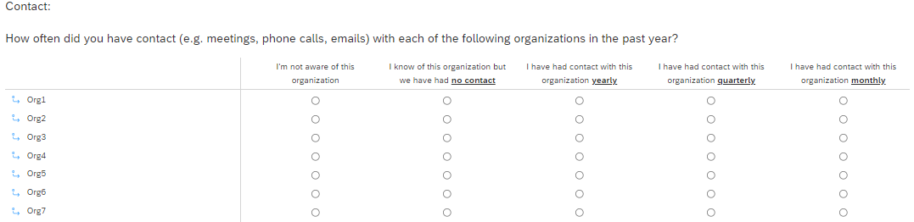
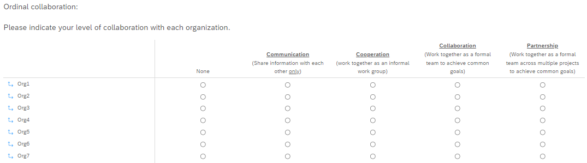
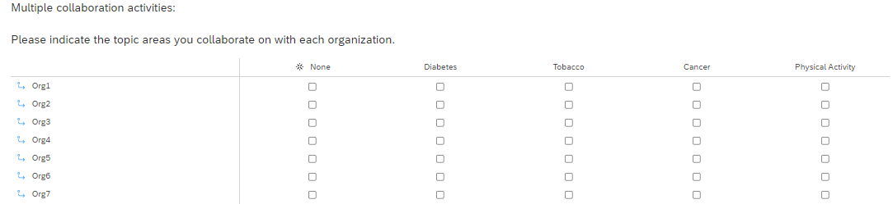

================

**This is a work in progress\!**

## Intro

I’m hoping this will serve as a “starter kit” for setting up and
analyzing a social network survey.

## What’s here

  - .qsf files to import template questions directly into Qualtrics
  - .csv contact file templates to import participant lists into Qualtrics
  - Example Survey with 
      - .pdf full survey example
      - .csv sample survey data (from full survey example)
      - .rmd sample survey data cleaning code *coming soon*

## Template questions

Qualtrics is a very common online survey platform for collecting social
network data. There is quite a bit of set up (including display logic)
that needs to happen both within the survey and also using some embedded
contact information (from participant contact information), so having a
starting template to import could save some time. If it doesn’t, then I
have probably wasted both your and my time\! 

**[Here](https://www.qualtrics.com/support/survey-platform/survey-module/survey-tools/import-and-export-surveys/)** are instructions on how to import .qsf files into Qualtrics.

Social network data also comes with some unique aspects of cleaning the
survey data. Here, I will offer some very basic examples that also might
save you some time (verdict is still out I guess\!).

There are two example .qsf files (at the moment). One that is geared
toward *individuals* (in this case, researchers) and another geared
toward *organizations*.

### Contact

In both, the first question is a “contact” question. This is often used
in social network surveys to whittle down to the smaller list of people
(through carry forward logic) that will be assessed further on in the
survey. It is meant to reduce some respondent burden (and some use it
for analyzing frequency of contact). Subsequent sections use the contact
question to determine which names will show.

It is important to note that the contact question itself includes
display logic as initially, you want to be sure that people/orgs are not
shown their own name to rate. This is where you need to be sure to
include a “sortID” or something alike in your uploaded contact sheet.
You will need to reference this embedded data for survey display logic.

### Collaboration

In the organizations template, two different collaboration questions are
offered:

  - The first allows just one activity per person/org e.g. the type of
    collaboration in an ordinal fashion (where one type is considered
    “stronger” or of more value than another). For example, in the
    template, we are saying that Cooperation is stronger than
    Communication only, and so on. On the back end, Communication will
    be assigned an edge weight of 1, Cooperation 2, Collaboration 3, and
    Partnership 4. To look at edge weights, you could look at average in
    vs. out, or decide to take the average between.

  - The alternative question version allows a person to choose multiple
    options. In this example, we are saying that we have separate
    activities that people can be involved in simultaneously. Notice if
    they select “None” here, it is exclusive (meaning they won’t be able
    to select it AND another activities). For this one, you could also
    choose not to include a “None” category and assume that if no
    selection is chosen, then no activities are engaged in. Removing
    also reduced the burden for a long survey (with many people to have
    to scroll through/select for). *Notice the removal of “only” from
    the Communication column.*

## Contact (participant list) .csv template

In order to send indidivual links via email through qualtrics, you are
required to upload a .csv file with at least these column names:

  - FirstName
  - LastName
  - Email

Beyond those, you also include any data that you’d like embedded with
the data or for use during the survey process. For social network
surveys, you want to include a numeric column that many call a “sort
id”. This just means that whatever number of contacts you have (say
50) will be in order 1 through 50 and then will also match the order in
which they appear in the survey. This is helpful both to used the
embedded field to avoid showing a person their own name to rate, and
also helps on data analysis on the back end (you’ll see).

For me, I also like to include any known attributes that we don’t plan
to ask in the survey. For example, I might include what city/state an
organization or indidivual is in or other attributes that might be
helpful in the analysis stage.
